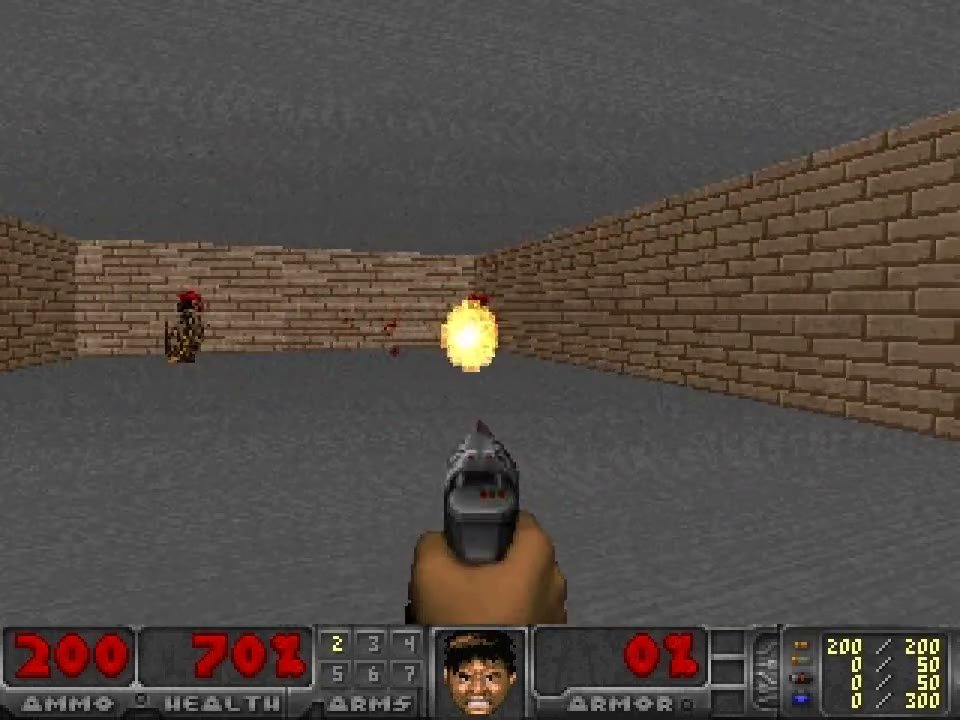

# doomfly-rl

A neural network wired like a fruit fly's brain, trained with gradient descent to play Doom.
Built end to end by the [Strands harness](https://github.com/strands-agents/harness-sdk) in five
days; the human typed about a dozen sentences. The story is in
[this post](https://nonatofabio.github.io/blog/posts/doomfly_autonomous.html).

[](https://nonatofabio.github.io/blog/posts/doomfly_autonomous.html)

> **Not [nftechie/doomfly](https://github.com/nftechie/doomfly).** That project runs the full
> MaleCNS connectome as a spiking network with fixed, biology-motivated input and output, and
> studies online plasticity in one real circuit. This one (`-rl`) treats the connectome as an
> inductive bias and *learns* the encoder, the decoder and one gain per synapse. Same name,
> opposite question; see [Relation to nftechie/doomfly](#relation-to-nftechiedoomfly) below and
> `docs/related-work-nftechie-doomfly.md` for the full comparison. The Python package is still
> `doomfly`.

## Results in one screen

Two negative results, both reproducible from checkpoints in S3 or on Hugging Face.

**The connectome carries no measurable inductive bias on the five ViZDoom scenarios.**
Same distillation recipe, 60k steps, 10-episode eval at the end (`docs/controls.md`):

| Backbone | Params | Train steps/s | basic | defend_the_center | health_gathering | deadly_corridor | defend_the_line |
|---|---|---|---|---|---|---|---|
| MaleCNS-49k connectome | 48.2 M | 646 | 78.2 ± 7.5 | 18.6 ± 1.8 | 1728 ± 616 | 2280.5 ± 2.4 | 21.0 ± 5.9 |
| same graph, edges shuffled (degree-preserving, seed 0) | 48.2 M | 1,454 | 78.2 ± 7.5 | 19.0 ± 1.7 | 1602 ± 597 | 2280.6 ± 2.2 | 21.7 ± 6.1 |
| same graph, edges shuffled (seed 1) | 48.2 M | 1,453 | 78.2 ± 7.5 | 18.4 ± 1.7 | 1921 ± 268 | 2281.0 ± 2.4 | 22.2 ± 5.1 |
| no connectome (stem → decoder) | 27.7 M | 14,686 | 77.5 ± 8.5 | 18.3 ± 1.6 | 1373 ± 555 | 2279.9 ± 2.4 | 23.0 ± 5.0 |

Every gap is inside one eval standard deviation. The wiring makes training 22× slower and buys nothing here.

**Critic-free GRPO does not improve the distilled student.** Twelve runs, one knob per run, 300
iterations each: no run beats the student outside eval noise on any scenario, and seven of twelve
regress `defend_the_center` by more than two standard deviations. The KL penalty to the frozen
student is the only load-bearing knob, and the strength that stops the drift also stops any gain
(`docs/grpo-study.md`).

Read a `doomfly-rl` score as "connectome-constrained RL agent", never as "a fly".

## Try the trained models

Checkpoints and the connectome file they need are on Hugging Face:
[fabiononato/doomfly-rl](https://huggingface.co/fabiononato/doomfly-rl).

```bash
uv venv && uv pip install -e . huggingface_hub
hf download fabiononato/doomfly-rl --local-dir hf
python -m doomfly.evaluate --ckpt hf/malecns49k_v2_final --connectome hf/connectome_malecns49k.npz \
    --episodes 10 --gif-dir /tmp/clips --tics --pick median --fmt mp4 --device cpu
```

Three checkpoints, all step 60,000 of the same recipe: `malecns49k_v2_final` (real connectome,
the footage above), `malecns49k_shuffled_s0` (degree-preserving shuffle), `malecns49k_noconn`
(no neuron layer). Loading goes through `doomfly.surgery.load_flynet`, which widens the old
22-action, 5-scenario head to 23/6 in memory so the checkpoints also run in free play.

## What the model is

`FlyNet` reuses the recipe of [mlabonne/chessfly](https://huggingface.co/mlabonne/chessfly): the
recurrent core is a real connectome, the wiring and the sign of every synapse are frozen, and
training learns one gain per synapse. Around it sit ordinary learned modules: a conv stem turns a
4-frame 72×96 grayscale stack into input currents on the visual sensory neurons, the network
unrolls 5 steps, and a readout takes the central, descending and motor neurons to 512 units and
then to one of 22 actions (23 after free-play surgery) with a per-scenario legality mask.

Two backbones: FlyWire FAFB v783 (138,639 neurons, 15.09 M edges, 54.5 M synapses) and a
49,393-neuron MaleCNS subgraph (9.05 M edges) from
[fernandofernandes/fly-connectome-49k](https://huggingface.co/datasets/fernandofernandes/fly-connectome-49k),
CC BY 4.0. Parameter counts for FlyWire-783:

| Component | Parameters |
|---|---|
| Synaptic log-gains (the connectome) | 15,091,983 |
| Homeostatic scale/shift | 1,386,390 |
| Stem, decoder, policy and value heads | 34,538,493 |
| **Total** | **51,016,866** |

Two thirds of the model is a conv net and an MLP, which is why the controls above exist.

Training: PPO teachers (one per scenario, Stable-Baselines3) → ε-greedy rollouts → distillation
into FlyNet → optional GRPO/RLOO fine-tuning against the frozen student.

## Roadmap

- **Free play on Freedoom II MAP01.** Zero-shot baselines are in `docs/freeplay.md`: the student
  survives 2.2× longer than random with its aiming prior and still dies in 8/10 episodes without
  leaving the first two rooms. Head surgery for `SELECT_NEXT_WEAPON` and a sixth scenario
  embedding is done and tested (`tests/test_surgery.py`). Next: GRPO on MAP01 with shaped reward
  on all three backbones, because a wiring prior would show where the policy has to learn rather
  than imitate (`docs/freeplay-plan.md`).
- **Fly vs fly.** ViZDoom duel with frozen-snapshot opponents and Elo, only if free play learns.
- **GRPO follow-ups.** Adaptive β with a KL target, 50-episode evals, greedy eval of the three
  teachers that have no curve.
- **Tutorial page.** `tutorial/index.html` is a self-contained walkthrough with hover-to-play
  footage; publishing it publicly is pending.

## Relation to nftechie/doomfly

Both projects take "a fly brain plays Doom" literally, but they make opposite design choices, and it
helps to be explicit about why.

**What they do.** `nftechie/doomfly` simulates the whole MaleCNS graph (166,700 neurons, 25.6 M edges,
no pruning) as leaky integrate-and-fire neurons with biological time constants, in an event-driven
C++ kernel. Pixels are mapped onto R1–R6/R8 photoreceptors through inferred ommatidia; actions are read
off named descending neurons (DNp20 rate difference → turn, DNpe017 → move/fire). Nothing on the input
or output side is learned. The only plastic synapses are the 4,184 KC→MBON11 connections, updated
online by a dopamine-gated anti-Hebbian rule, with two PPL101 dopamine cells driven by in-game damage.
Their `AGENTS.md` forbids cropping circuits, pruning edges, or "replacing the network with a game
policy". They publish negative results: the v6 candidate did not pass its own survival gates, and the
repo says so.

**Why that is a coherent design.** It is a computational-neuroscience experiment. The question is
whether the *actual* wiring, run as a spiking system with plausible sensors and effectors, produces
useful behaviour, and whether a *known* plasticity mechanism in a *known* circuit can shape it. Every
lever we pull here — a learned conv stem, a learned readout, a free gain on every synapse, a value head,
distillation from PPO teachers — would contaminate that question, because a conv net and an MLP can
learn to play Doom on their own and the connectome in the middle could be doing nothing. Refusing those
levers is what makes "no learning demonstrated" a meaningful result rather than a bug.

**Why we do it differently.** `doomfly-rl` asks the ML question instead: if a recurrent network is
constrained to the fly's connectivity and synapse signs, can optimisation make it play, and how does
that compare with the same recipe on chess (`chessfly`)? Here the connectome is a structural prior, not
a claim about biology. The controls in `docs/controls.md` are the answer so far: on these scenarios,
the prior is worth nothing measurable.

Neither project invalidates the other. Theirs tells you what the wiring does on its own; ours tells you
what the wiring is worth as a prior once you let gradient descent in.

## How it was built

Every commit in this repo was written by the Strands harness working from `AGENTS.md`, which says
what the project is for, what it is not, and the rules that keep results honest: every number
traces to a checkpoint, one change per run, negative results go in `docs/`, no push or launch
without being told. `docs/harness-findings.md` lists what broke along the way (cuSPARSE has no
mixed-dtype kernels, `nvidia-smi | head` under `pipefail`, an unquoted `|` in cloud-init, a
BatchNorm train/eval mismatch caught by a CPU smoke test before the first GPU run).

## Layout

| Path | What it is |
|---|---|
| `doomfly/connectome/` | Connectome ETL (`build.py`, `build_malecns49k.py`): FlyWire / MaleCNS tables to `data/processed/connectome_*.npz` |
| `doomfly/model/` | `sparse.py` (sparse recurrent op), `flynet.py` (the model) |
| `doomfly/doom/` | `env.py` (ViZDoom wrapper), `actions.py` (action vocabulary), `teacher.py` (PPO teachers), `record.py` (rollouts) |
| `doomfly/train.py` | Distils the teachers into FlyNet. `--tb DIR` writes TensorBoard scalars |
| `doomfly/grpo.py` | Critic-free GRPO / RLOO fine-tuning of a distilled student against a frozen reference |
| `doomfly/surgery.py` | Widens a trained head for free play; `load_flynet` is the one checkpoint loader |
| `doomfly/freeplay_zero_shot.py` | Zero-shot evaluation on Freedoom II MAP01 |
| `doomfly/evaluate.py` | Plays the trained model and writes GIF/MP4 footage (`--tics`, `--pick`, `--fmt`) |
| `infra/` | CDK stack `DoomFly` (S3 bucket, launch template, IAM, ASG) in `us-west-2` |
| `scripts/` | Ship, launch, watch, clips, publish (see below) |
| `tutorial/` | `generate.py` + `template.html` -> `index.html` infographic |
| `docs/` | Controls, GRPO study, free play, related work, harness findings |
| `AGENTS.md` | What this project is for and the rules agents follow |

## Pipeline on the GPU box

`scripts/run_all.sh` runs on the instance at boot. Stages, each with a `markers/stageN.done` file:

0. bootstrap (venv, deps, pull code + connectomes from S3)
1. PPO teachers, one per scenario, in parallel
2. epsilon-greedy rollouts from each teacher
3. FlyNet distillation, `flywire783` then `malecns49k` (in parallel if there are 2+ GPUs)
4. final S3 sync, then the instance shuts down

Knobs (environment): `DOOMFLY_BUCKET`, `DOOMFLY_PREFIX`, `FRAMES_PER_SCENARIO`, `TRAIN_STEPS`, `BATCH`, `N_ENVS`, `STAGES`, `STOP_WHEN_DONE`.

## Operate

```bash
export AWS_PROFILE=fnp3
scripts/ship.sh                         # code + connectomes -> s3://doomfly-<acct>-us-west-2/{code,connectomes}
scripts/launch.sh                       # ASG in us-west-2 (desired=1)
scripts/launch_region.sh us-east-2      # no capacity at home? walk TYPES x AZs in another region
scripts/boxes.sh                        # every trainer box, all regions, with its S3 prefix
scripts/status.sh [train|teacher|record] # tail the S3 log mirror (DOOMFLY_PREFIX=... for a prefixed box)
scripts/tb.sh                           # TensorBoard: SSM port-forward from the box -> http://localhost:6006
scripts/tb.sh live i-0123 us-east-2     # ... a specific box (PORT=6007 for a second one)
scripts/tb.sh s3                        # TensorBoard from the S3 mirror, works after the box is gone
```

Two boxes must not share an S3 prefix. Give the second one `DOOMFLY_PREFIX=<name>` (and tag it `Prefix=<name>`).

## Local development

```bash
uv venv && uv pip install -e .
python -m doomfly.doom.teacher --scenario basic --steps 2000 --n-envs 2 --out /tmp/t --tb /tmp/tb/teachers
python -m doomfly.doom.record --scenario basic --teacher /tmp/t/basic.zip --frames 400 --out /tmp/r
python -m doomfly.train --connectome data/processed/connectome_783.npz --rollouts /tmp/r --out /tmp/run \
    --tb /tmp/tb/train --steps 60 --batch 8 --device cpu
tensorboard --logdir /tmp/tb
```

## License and data

Code and weights: MIT (`LICENSE`). The MaleCNS-49k connectome derives from
[fernandofernandes/fly-connectome-49k](https://huggingface.co/datasets/fernandofernandes/fly-connectome-49k)
(CC BY 4.0). The FlyWire v783 graph derives from the Shiu et al. author release; see
`data/processed/connectome_783.json` for source hashes and references.
